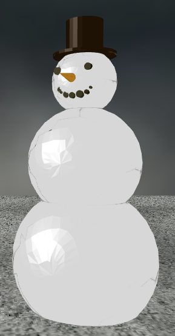
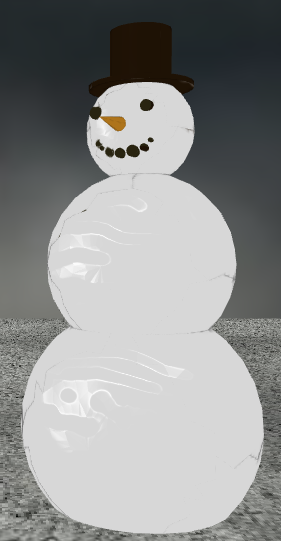

Group Project -- Day/Night Cycle and Seasons
---

__Team Members:__

Mudith Mallajosyula, UID 404937201

Oyku Deniz Bozkurt, UID 105629052

---

__Introduction__

Our project explored the passage of time, in both days and seasons. We designed a house sitting on a grassy plain with a cloudy sky behind it; each "day" the sun rises and sets, and over time the "seasons" change, altering the lighting, textures, and features of the landscape.

We also included several "decoration" pieces corresponding to each season; these decorations and the house itself have corresponding bump maps to allow for more intricate textures. 

Additionally, we added musical accompaniments for each season, which can be controlled by the user.

The user has the following control options available:

  * Toggle Bump Maps on and off
  * Switch between several fixed viewpoints, or a free camera
  * Toggle the day/night cycle or the seasons cycle
  * Select a specific season
  * increase the sun's brightness & the speed of the cycles
  * Select different music tracks and control them

---

__Advanced Features__

The advanced feature we chose to implement was **Bump Maps**.

We created models and textures in Blender, and then created a second pseudo-texture bump map, also in Blender. This bump map was passed as a secondary texture to the GPU via the custom Bump_Map_Texture class, which extends PhongTexture. This class treats the bump map as a texture and uses the bump vectors corresponding to the texture coordinates to perturb the normals of the fragment shader. This results in more intricate-looking textures and shading without the need for additional vertices or model complexity.

 
> original texture (left) vs bump map (right)

---

__References__ 

Thanks very much to the TAs and the professor for supplying the template code and library functions.

__Image sources:__

http://jessicatregarth.com/2014/03/spring-sky/

https://www.globaltravelerusa.com/blog/the-floods/dramatic-dark-sky-and-clouds-cloudy-sky-background-black-sky-b/

https://horizon-media.s3-eu-west-1.amazonaws.com/s3fs-public/field/image/clouds-mf.jpg

https://3dwarehouse.sketchup.com/model/3d410e24b5421ea3508a82ada06acb6b/Grass-Texture

*All other objects and textures were designed by us using AutoCAD and Blender.*

__Music (Public domain):__
